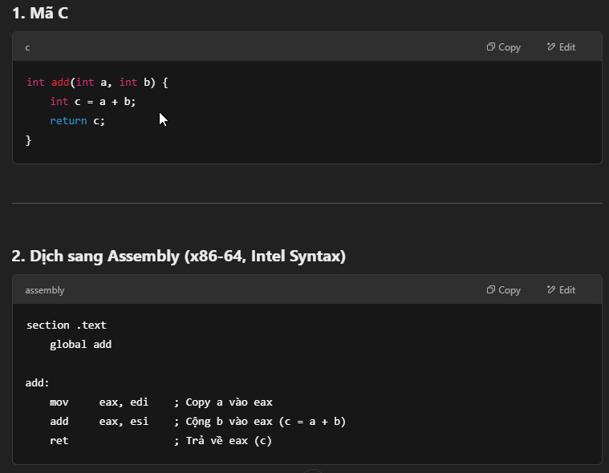
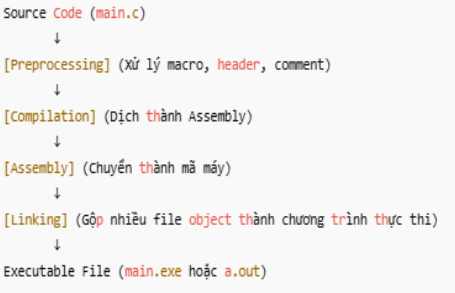

# 1. INCLUDE
    đầy là chỉ thị dùng để khai báo 1 file nguồn được viết sẵn, ta sẽ khai báo chỉ thị này cùng tên với file .c hoặc .cpp mà chúng ta cần thêm vào chương trình.
    * #include" ": khi file include chúng ta đặt trong " ", thì chương trình, hệ thống sẽ tìm trong folder của project hiện tại có file đó hay không và thay thế vào chương trình.
    * #include< >: trong trường hợp này thì hệ thống sẽ tìm trong các thức mục cài đặt gốc ở bất kỳ đâu trong máy tính để lấy file đó
# 2. Quá trình compiler
    Khi các chương trình viết bằng các ngôn ngữ bậc cao như C/C++ run được thì sẽ phải trả qua các bước sau:
    
    Bước1: Tiền xử lý (Preprocessing)
    gcc -E main.c -o main.i

    Xử lý thư viện và header, các define, ifdef, elseif
        Thay thế thư viện #include< > và file header #include"" bằng nội dung bên trong các file.
    Thay thế các macro
        Thay thế tất cả chỉ thị #define bằng nội dung mà chúng được định nghĩa
    Xử lý điều kiện tiền xử lý
        Các chỉ thị như #if, #ifdef, #ifndef, #else, #endif sẽ được dùng để quyết định đoạn mã nào sẽ được giữ và đoạn mã nào sẽ bị loại bỏ.
    Xử lý comment
        xoá bỏ đi các comment
    
    Bước 2: Biên dịch (Compiler)
    gcc -S main.i -o main.s

    dịch mã nguồn C sang hợp ngữ (assembly) để máy tính có thể hiểu được và thực thi các bước sau.
    vd: 
    Bước 4: Linker liên kết
    gcc main.o main1.o main2.o -o program
        liên kết các file .o lại thành 1 file thực thi .exe
    Bước5: Run chương trình
     ./program

     Tóm tắt:
     